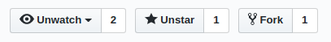

# Instruções para o Workshop

## Passo 1 - Iniciando o ambiente

Se você ainda não tem o git no seu computador, [instale-o aqui](https://git-scm.com/downloads)

Abra o terminal _ou cmd_ e digite:

```
git config --global user.name "Seu Nome"
git config --global user.email "seu@email.com"
```


## Paso 2 - Faça um Fork

Clique no botão "Fork" no canto superior direito da página, isto irá criar uma cópia deste repositório para a sua conta.


## Passo 3 - Clone o seu fork


**Clone** o seu **Fork** para a sua máquina, este comando irá relizar o "donwload" do repositório, assim você poderá editar os arquivos localmente para depois enviá-los de volta para o GitHub.

**dica:** navege para o Desktop ou para alguma pasta do seu computador em que você queira baixar os arquivos antes de clonar

Para clonar digite em seu terminal:

```
git clone https://github.com/seuUsuario/Aprenda-Git.git

```

## Passo 4 - Edite o arquivo README.md na sua máquina

Então vá para a pasta "WorkshopGit" e edite o arquivo README.md, você pode utilizar qualquer editor de texto a sua escolha, como por exemplo o bloco de notas ou o (VSCode)[https://code.visualstudio.com/]

Note que no arquivo README.md existe um template, mas fique livre para modificar o template da forma que preferir, o arquivo agora é seu!

Volte para as instruções quando tiver terminado de editar o arquivo README.md da forma que você gostaria

## Passo 5 - Adicione os arquivos modificados a zona de stage

Nem sempre você irá querer "salvar" todos os arquivos que foram modificados naquele momento no git, apenas os arquivos adicionados à zona de **stage** são commitados, você pode especificar arquivo por arquivo a ser adicionado, digitando os seus nomes, ou utilizar o símbolo: `.` para indicar todos os arquivos da pasta, assim:

**dica:** utilize o comando ```git status``` a cada mudança, bem como antes e depois do comando git add.

**dica:** experimente criar um novo arquivo na pasta, com o nome de "localNotes.md" por exemplo, na qual você não quer compartilhar por exemplo

``` markdown
git add .
```
