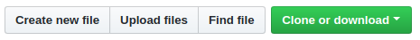

# Instruções para o Workshop

## Passo 1 - Iniciando o ambiente

Se você ainda não tem o git no seu computador, [instale-o aqui](https://git-scm.com/downloads)

Abra o terminal _ou cmd_ e digite:

```
git config --global user.name "Seu Nome"
git config --global user.email "seu@email.com"
```


## Paso 2 - Faça um Fork

Clique no botão "Fork" no canto superior direito da página, isto irá criar uma cópia deste repositório para a sua conta.

**dica:** Se você estiver na página do github.io acesse o repositório em github.com para criar o fork.

## Passo 3 - Clone o seu fork



**Clone** o seu **Fork** para a sua máquina, este comando irá relizar o "donwload" do repositório, assim você poderá editar os arquivos localmente para depois enviá-los de volta para o GitHub.

**dica:** observe se o seu nome de usuário está na url a ser clonada

**dica:** navege para o Desktop ou para alguma pasta do seu computador em que você queira baixar os arquivos antes de clonar

Para clonar digite em seu terminal:

```
git clone https://github.com/seuUsuario/Aprenda-Git.git

```

## Passo 4 - Edite o arquivo README.md na sua máquina

Então vá para a pasta "WorkshopGit" e edite o arquivo README.md, você pode utilizar qualquer editor de texto a sua escolha, como por exemplo o bloco de notas ou o [VSCode](https://code.visualstudio.com/)

Note que no arquivo README.md existe um template, mas fique livre para modificar o template da forma que preferir, o arquivo agora é seu!

Volte para as instruções quando tiver terminado de editar o arquivo README.md da forma que você gostaria

## Passo 5 - Adicione os arquivos modificados a zona de stage

Nem sempre você irá querer "salvar" todos os arquivos que foram modificados naquele momento no git, apenas os arquivos adicionados à zona de **stage** são commitados, você pode especificar arquivo por arquivo a ser adicionado, digitando os seus nomes, ou utilizar o símbolo: `.` para indicar todos os arquivos da pasta, assim:

**dica:** utilize o comando ```git status``` a cada mudança, bem como antes e depois do comando git add.

**dica:** experimente criar um novo arquivo na pasta, com o nome de "localNotes.md" por exemplo, na qual você não quer compartilhar por exemplo

``` markdown
git add .
```
## Passo 6 - Faça um "Commit"

- Assim você irá salvar suas modificações no repositório local

- Dê um "Push" para que as modificações sejam enviadas para o servidor do GitHub!

```markdown
git commit -m 'mensagem legal explicando o voce mudou'
git push
```

Agora se tudo deu certo até então, você poderá ver as suas mudanças no seu repositório no servidor do GitHub.

## Passo 7 - Gerando um site com GitHub Pages


Na aba de *Settings* desça até encontrar a parte de **GitHub Pages**, utilize o *Theme Chooser* para escolher um dos templates para o seu site clicando no botão *Choose a theme*

**Pronto** agora você já tem sua própria página online através do GitHub Pages, e a url está disponível em *Settings > GitHub Pages*, se você renomear o repositório para "seunomedeusuario.github.io", essa será a url do seu site.

**dica:** além dos templates disponíveis no *Theme Chooser* que são configuráveis em um clique, você também pode configurar manualmente outros templates depois se achar interessante, [aqui você encontra uma lista mais completa](http://jekyllthemes.org/). Você também pode criar [seus próprios templates Jekyll](https://jekyllrb.com/).


## Valeu

Este tutorial foi criado com ❤️ por [Otacilio Maia](otaciliomaia.com), sinta-se à vontade para tirar dúvidas através do email contato@otaciliomaia.com ou através de redes sociais.

Aproveite e confira a sessão de indo além logo abaixo para conhecer mais conceitos de Git. 

# Indo Além

## Branch

> git branch

Retorna uma lista com os branches, o item marcado com um asterisco é o branch atual.

### Conceito de branch

Um dos conceitos mais interessantes de git é o de branch, por padrão todo repositório começa com um branch **master**, onde no 
branch master deve conter a versão mais estável do seu código, que é entregue aos seus usuários.

Justamente para evitar quebrar o código principal enqunto o desenvolvimento acontece, é muito comum criar-se pelo menos mais um branch, chamado **develop**, que é usado durante o desenvolvimento, e uma vez que a versão está estável o suficiente para um release, enviamos o código para o **master**.

Uma das técnicas mais comuns de gerenciamento de repositório é o git flow, [este artigo explica com detalhes](https://medium.com/trainingcenter/utilizando-o-fluxo-git-flow-e63d5e0d5e04)

### Criando um branch

> git branch nome-do-branch

Cria um novo branch, note que ao criar um novo branch com git branch você continua no branch atual.

## Pull 

> git pull

Obtém as mudanças do seu servidor remoto (No caso do repositório do GitHub), para o seu servidor local (No caso o seu computador), se não houver mudanças é exibida a mensagem ```Already up to date.```

## Checkout

> git checkout nome-do-branch

Muda para o branch selecionado, também é possível criar um novo branch e mudar para o branch utilizando o comando ```git checkout -b "nome-do-branch"
